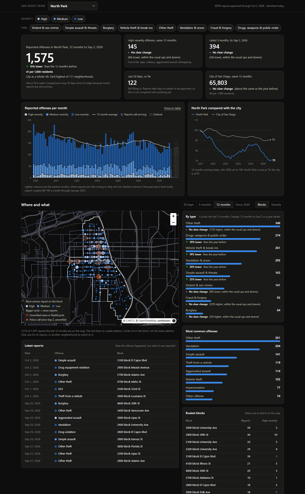

# San Diego neighborhood crime dashboard

A dashboard that answers one question about one neighborhood: **how much crime is reported here, how serious is it, and is it getting better or worse?** It opens on North Park and works for any of San Diego's 125 police beats.



It is built from the San Diego Police Department's public offense records (January 2020 to yesterday), with an unofficial layer of local news headlines, Reddit posts and recent police dispatch calls on top. Rates per resident use the 2020 Census. There is no server and no database. A Python script turns the city's CSV files into small JSON files, and a plain HTML and JavaScript page reads them.

## Run it

You need Python 3.11 or newer. Node is only needed for the JavaScript tests.

```
python -m venv .venv
.venv\Scripts\activate              # macOS / Linux: source .venv/bin/activate
pip install -r requirements.txt

python -m pipeline refresh          # download, build, collect chatter (about 10 minutes the first time)
python -m pipeline serve            # opens http://localhost:8000
```

Run `refresh` again whenever you want newer data. The city rewrites its files every morning.

| Command | What it does |
| --- | --- |
| `python -m pipeline fetch` | Downloads the SDPD files, offense reports and this year's dispatch log, into `data/` (about 290 MB; files that have not changed are skipped) |
| `python -m pipeline build` | Turns `data/` into `site/data/` (about 20 seconds) |
| `python -m pipeline chatter` | Collects news and Reddit posts about every neighborhood into `chatter/items.jsonl` (about 6 minutes, most of it one Google News search per neighborhood name). It needs a build first, which is what knows the neighborhoods. Add `--backfill` once to dig for older items (about 40 minutes, because Reddit allows one search a minute), or `--offline` to re-score what is stored without fetching |
| `python -m pipeline serve` | Serves `site/` at http://localhost:8000 |
| `python -m pipeline refresh` | `fetch`, then `build`, then `chatter` |
| `python -m pipeline census` | Makes `census/blocks_2020.csv` again from the Census Bureau's file (an 80 MB download). The file is in the repository and never changes, so this is only for when it is lost |

Any neighborhood can be opened from the menu or by clicking it on the map, and each has its own news, Reddit posts and police calls. To change which one the page opens on, edit `HOME_BEAT` in [pipeline/config.py](pipeline/config.py). The same file lists the news feeds and subreddits that are read (`CHATTER_FEEDS`, `CHATTER_SUBREDDITS`), the names people use for a neighborhood that SDPD does not (`CHATTER_ALIASES`), the SDPD names too ordinary to search for (`CHATTER_SKIP`), and the outlets whose headlines are left out (`CHATTER_SKIP_OUTLETS`).

## What is on the page

- **The headline.** Offenses reported in the past 12 months, the change from the 12 months before, and whether that change is more than chance. Under it, the same count per 1,000 residents, with the city's rate and where the neighborhood ranks among the 111 that have one. Four smaller figures sit beside it: high-severity offenses, the latest 3 months, the last 30 days so far, and the city as a whole.
- **Monthly trend since 2020**, stacked by severity, with a 12-month average line and a rough outlook for the next three months.
- **The neighborhood against the city**, both as running 12-month totals indexed to 2020.
- **Map.** One circle per block, sized by the number of reports and colored by the most serious one. Click a circle for its reports. A density view is one click away.
- **By type, busiest blocks, latest reports**, all for the period you pick (30 days, 3 months, 12 months, or everything since 2020).
- **Next-door neighborhoods**, compared on the same footing: offenses, offenses per 1,000 residents and per square mile, and the change.
- **What people are saying**, for whichever neighborhood is open. News and Reddit posts that name it, grouped so one incident covered by eight outlets shows once. A post that names an intersection or block is pinned on the map. Police dispatch calls from the last 30 days are listed day by day and drawn as small dots on their blocks.

Severity and type filters at the top apply to everything. The filters, period and neighborhood are kept in the URL, so a view can be bookmarked or shared.

## Five decisions behind the numbers

**1. Paperwork is not crime.** The largest single code in SDPD's data is "All Other Offenses," and most of it is not crime at all: 72-hour mental-health holds, warrant arrests, parole and probation violations, missing-person reports. That is 15% of all records. They are left out of every count and off the map. The rule is in [pipeline/categories.py](pipeline/categories.py).

**2. A neighborhood is where the address is.** SDPD labels each record with a beat, but about one label in twelve disagrees with where the block address actually falls. Hundreds of reports at plainly North Park addresses carry another neighborhood's label, and some labeled North Park geocode miles away. A map needs the two to agree, so a record is placed by its address when the city's geocoding is confident and by SDPD's label otherwise. Totals therefore differ slightly from SDPD's own dashboard.

**3. Late reports must not flatter the present.** Reports reach the data days to months after the offense. About a quarter of a month's reports are still missing when the month ends, and burglary and fraud run later still. Comparing a fresh period with a fully reported old one always makes the present look safer than it is. So every comparison here:

- stops 30 days before the newest data, and
- counts the year-earlier period only as it looked at the same point last year.

`python -m analysis.backtest` replays this on the first of every month since 2022: pretend the data ended that day, estimate the year-over-year change, and compare it with what the change turned out to be. Errors, in percentage points:

| North Park | Raw counts | This method |
| --- | --- | --- |
| 12 months, ending 30 days back | 2.0 too low on average | 0.7 on average, 1.8 at worst |
| 3 months, ending 30 days back | 5.1 too low | 2.3 on average, 7.0 at worst |
| 3 months, ending today | 13.8 too low | 4.3 on average, 15.4 at worst |
| 30 days, ending today | 29.6 too low | 10.9 on average, 37.3 at worst |

The last two rows are why the newest 30 days are shown but never compared. Approval speed changes too much from month to month (there was a backlog in early 2026 and a speed-up that September) for any correction to hold there.

A change is called "lower" or "higher" only when it is at least 5% and at least twice the ordinary chance variation for counts that size. Otherwise the page says "no clear change."

**4. Severity is three plain levels.** High is serious violence, medium is a direct threat to a person, home or car, and low is property loss and nuisance. The full mapping from FBI offense codes is one table in [pipeline/categories.py](pipeline/categories.py). It is this project's judgment, not an official scale, and that file is the one place to change it.

**5. A rate needs the right residents, or none.** Residents come from the 2020 Census, block by block, and a block belongs to the neighborhood its centre falls in. Added up, the blocks come within 0.01% of the city's official count of 1,386,932. Two things are then left out on purpose:

- **People SDPD does not police where they live:** those in barracks or on ships, in jails and in college dorms, 46,565 in all. Crime there is mostly recorded by the Navy, the Sheriff or campus police. Counted in, nearly two thirds of Barrio Logan's residents would be sailors at the naval base and nine tenths of Torrey Pines' would be UCSD students in dorms, and their rates would come out at a third and a tenth of what they are.
- **A rate where it would mean nothing:** a neighborhood with fewer than 1,000 residents (Balboa Park would come out at 1,700 offenses per 1,000 residents), or one where a single census block holds more than half the residents, because the count then hangs on which side of the line that block's centre falls. Fourteen of the 125 neighborhoods get no rate.

The rules are in [pipeline/census.py](pipeline/census.py), and the 1,000 is `MIN_RESIDENTS` in [pipeline/config.py](pipeline/config.py).

## How it is put together

```
City open data portal ──fetch──▶ data/*.csv, *.geojson ──build──▶ site/data/*.json ──▶ site/ (static page)
News and Reddit RSS ───chatter─▶ chatter/items.jsonl ─────────────┤
2020 Census (once) ────census──▶ census/blocks_2020.csv ──────────┘
```

| Path | What is in it |
| --- | --- |
| `pipeline/fetch.py` | Downloads the yearly SDPD files; a failed download never replaces a good file |
| `pipeline/build.py` | DuckDB: load, classify, place each offense in a neighborhood, write JSON |
| `pipeline/categories.py` | Offense code to category and severity; what counts as paperwork |
| `pipeline/chatter.py` | News and Reddit: fetch, match to neighborhoods by name, score for relevance, group into stories, locate intersections |
| `pipeline/census.py`, `census/blocks_2020.csv` | Residents: the 2020 Census count for every block in the county (kept in the repository), and the rules that turn blocks into a neighborhood's residents |
| `pipeline/dispatch.py` | Police dispatch: each neighborhood's recent calls about a possible crime, in plain words, placed on their blocks |
| `pipeline/config.py` | Home neighborhood, data URLs, the fewest residents a rate needs, chatter settings |
| `site/js/stats.js` | Every number on the page, as pure functions |
| `site/js/charts.js`, `map.js`, `app.js` | Hand-drawn SVG charts, the MapLibre map, and the page logic |
| `analysis/backtest.py` | The replay behind decision 3 |
| `tests/` | Python tests, including a full build of a tiny made-up city, and JavaScript tests for the statistics |

The build is rerun from scratch every time, because the city rewrites past years as investigations proceed. It writes to a temporary folder and swaps it in only on success. The page loads about 400 KB of its own files up front, then three files for the neighborhood on screen: its offenses (North Park's is 400 KB), its stories and its police calls.

The only Python dependency is DuckDB. The page uses MapLibre GL from a CDN and CARTO's free Dark Matter basemap, with no build step and no API keys.

## Tests

```
python -m pytest
node --test tests/js/stats.test.mjs
```

The JavaScript suite includes a check that the browser's year-over-year counts match the pipeline's for the real data, when a build is present.

## Publishing on GitHub Pages

[.github/workflows/publish.yml](.github/workflows/publish.yml) runs the tests, downloads the data, builds, and publishes `site/` every morning and on every push. To turn it on, push the repository to GitHub and set Settings → Pages → Source to "GitHub Actions". Pages is free for public repositories.

This workflow has not been run yet; it was written without a GitHub repository to try it on.

The workflow does not collect news or Reddit posts (Reddit turns away requests from cloud servers). It publishes whatever is in `chatter/items.jsonl`, so run `python -m pipeline chatter` locally and commit that file when you want the feed updated. Dispatch calls come with the city's files, so the published page gets those fresh every morning.

## Limits

- These are **reports**, not convictions, and crimes nobody reported are not here.
- Addresses are rounded to the hundred-block. A circle marks a block, never a building.
- A rate per resident divides everyone's reports by only the people who live there. Where many people come to work, shop, drink or swim (downtown, Mission Valley, Old Town, the beaches) it runs far above anything a resident experiences: East Village comes out at 261 per 1,000 and Old Town at 516, against 41 for North Park. Compare residential neighborhoods with each other, not with those.
- Residents are counted as of 2020. Where a lot of housing has been built since, more people live there now and the true rate is lower than the one shown.
- A census block is given whole to the neighborhood its centre falls in, though a few straddle a boundary. Checked once against splitting every block by area, 96 of the 111 neighborhoods with a rate agree within 5% and 104 within 10%. The widest gaps are Loma Portal (19% more residents by this method), Midway District (15% fewer) and Torrey Highlands (14% fewer).
- The public CSV files carry the date of an offense but not the time of day.
- The chatter filter is keyword rules, and a story is matched to a neighborhood by name. It misses some relevant posts and keeps a few irrelevant ones, more of them where the name is also a place somewhere else (Sacramento has an Oak Park, the Bay Area a Burlingame). Twelve of SDPD's names are too ordinary to search for at all (`CHATTER_SKIP` in [pipeline/config.py](pipeline/config.py)); those neighborhoods get their police calls, and stories that use a wider name such as City Heights. Coverage is uneven: when this was written the typical neighborhood had about 40 stories, Pacific Beach had 178, and ten had none. The number of posts says nothing about the amount of crime.
- Chatter history is thin. Google News returns at most 100 headlines for a name (`--backfill` searches the names that fill that one half-year at a time, which recovers the notable older events, not everything), Reddit's search returns the 100 newest posts with a crime word (about a month of r/sandiego; `--backfill` reaches back about three months, and a year or two for posts that name a neighborhood), and an outlet's own feed holds only its last few days. So run `chatter` at least once a month, and weekly if the outlets' feeds are to add anything.
- A dispatch call is what someone told a dispatcher, not a confirmed crime, and most end without a report. Only the last 30 days are shown, and only the call types that describe a possible crime (the table in [pipeline/dispatch.py](pipeline/dispatch.py)). The log has no coordinates, so a call's neighborhood is SDPD's own label (decision 2 cannot be applied to it) and a call is drawn only on a block that already has an offense on record: 89% of calls across the city when this was written, 114 of 117 in North Park. The log runs about two days behind.
- Nextdoor, Facebook groups, Threads and X are not sources. None of them has a public feed: posts sit behind a login, and their APIs are closed, paid, or approval-only. Reading them would mean scraping with a personal account, which breaks their terms and breaks whenever the site changes.
- The outlook is the past year's level adjusted for season. It describes what "no change" would look like and does not predict events.

## Ideas for later

- **Time of day.** The city's live map service has the hour of each offense; joining it in would show when things happen.
- **More from the dispatch log.** It goes back to 2015 and has the time of every call. Only the last 30 days are used, as a feed; a trend of calls, or calls by hour, would come from the same files.
- **A better chatter filter.** A small language model could replace the keyword rules for relevance and location.
- **"Near my block."** Counts within a chosen distance of a point, across neighborhood lines.
- **Better resident counts.** Splitting each census block between neighborhoods by area instead of by its centre, and bringing 2020 up to date with the Census Bureau's yearly estimates.

## Data and credits

- [Police NIBRS Crime Offenses](https://data.sandiego.gov/datasets/police-nibrs/), [Police Calls for Service](https://data.sandiego.gov/datasets/police-calls-for-service/) and [Police Beats](https://data.sandiego.gov/datasets/police-beats/), City of San Diego open data portal.
- [2020 Census Redistricting Data (P.L. 94-171)](https://www.census.gov/programs-surveys/decennial-census/about/rdo/summary-files.html), U.S. Census Bureau: people, and people in group quarters, by census block.
- Basemap © [CARTO](https://carto.com/attributions), map data © [OpenStreetMap](https://www.openstreetmap.org/copyright) contributors, drawn with [MapLibre GL JS](https://maplibre.org/).
- Headlines from Google News RSS and from the RSS feeds of NBC 7, FOX 5, 10News, CBS 8, Times of San Diego, KPBS and Patch; posts from Reddit's public RSS feeds. All are shown as title, source, a short excerpt and a link. No usernames are stored.
